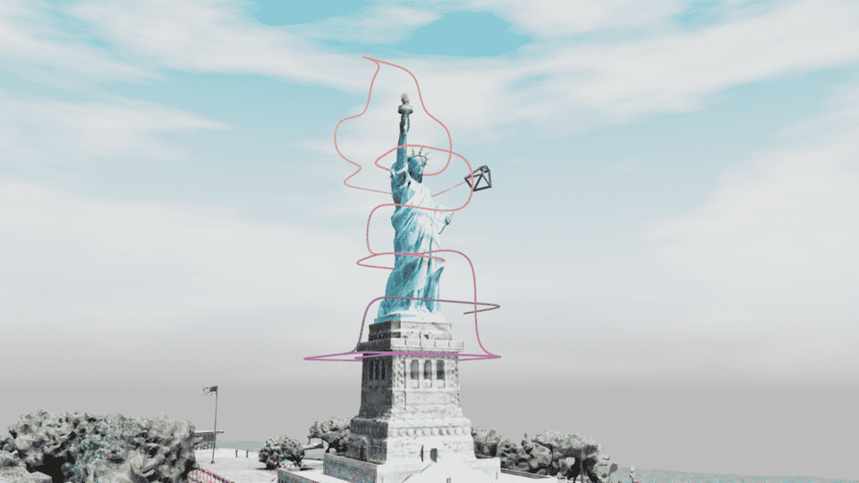
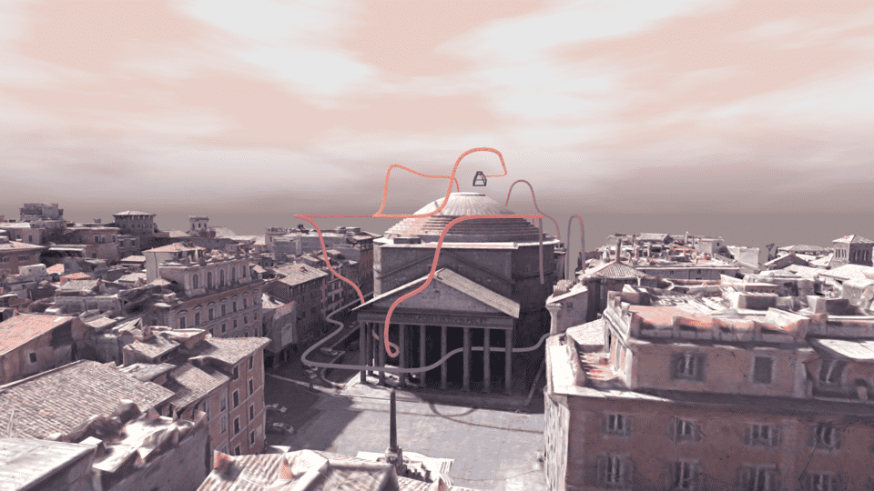
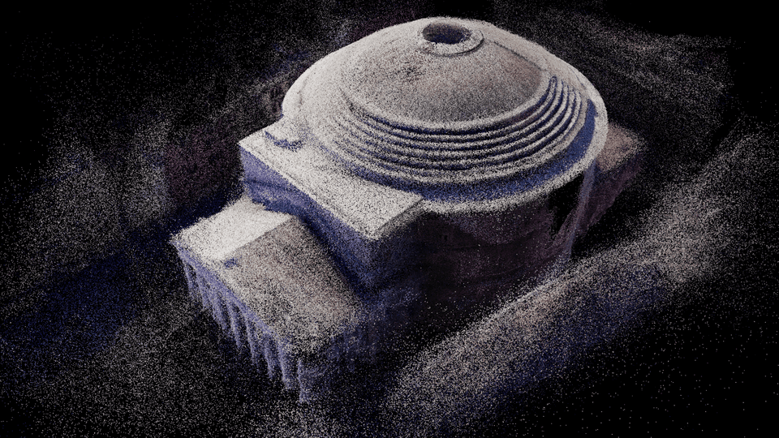
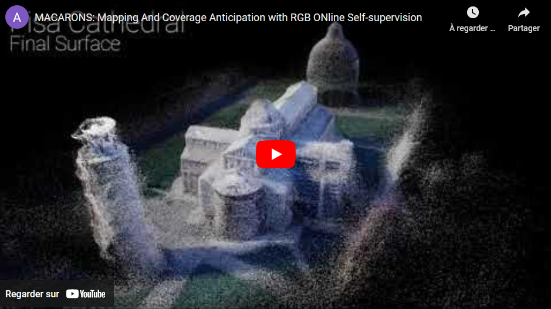
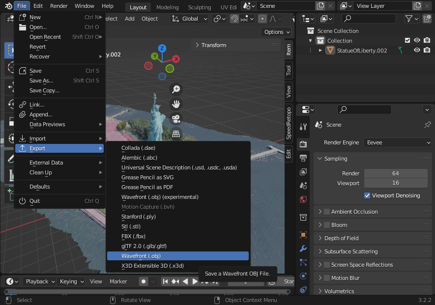
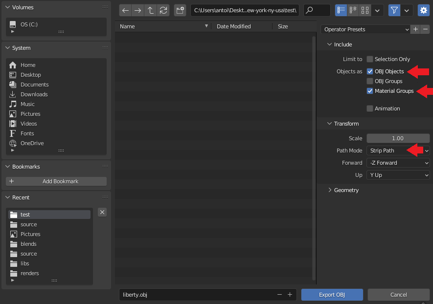
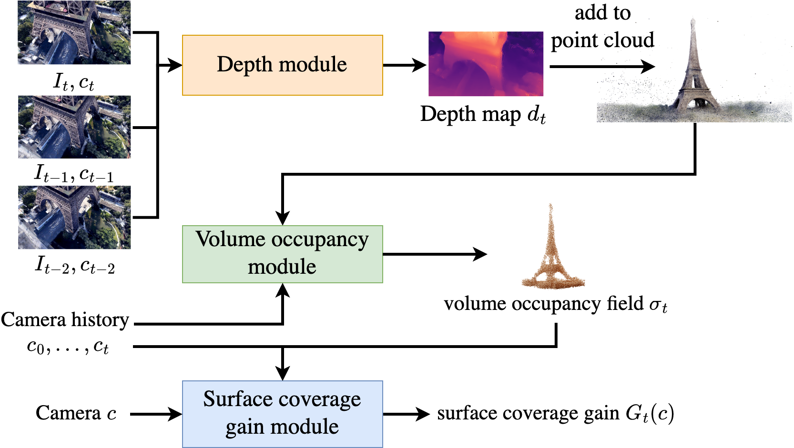

<div align="center">

# MACARONS: Mapping And Coverage Anticipation with RGB ONline Self-supervision

<font size="4">
<a href="https://github.com/Anttwo">Antoine Guédon</a>&emsp;
<a href="https://www.tmonnier.com/">Tom Monnier</a>&emsp;
<a href="https://imagine.enpc.fr/~monasse/">Pascal Monasse</a>&emsp;
<a href="https://vincentlepetit.github.io/">Vincent Lepetit</a>&emsp;
</font>
<br>


 <br>

 <br>

</div>

## Description

Official PyTorch implementation of 
[**MACARONS: Mapping And Coverage Anticipation with RGB ONline Self-supervision**](https://imagine.enpc.fr/~guedona/MACARONS/) 
(CVPR 2023).<br>
Also includes an updated and improved implementation of our previous work 
[**SCONE: Surface Coverage Optimization in Unknown Environments by Volumetric Integration**](https://arxiv.org/abs/2208.10449) 
(NeurIPS 2022, Spotlight), on which this work is built.

We introduce a method that **simultaneously learns** to **explore new large environments** and to **reconstruct them in 3D** from **color images** 
in a **self-supervised fashion**. This is closely related to the **Next Best View problem (NBV)**, where one has to identify where to move 
the camera next to improve the coverage of an unknown scene.

<div align="center">

<a href="https://www.youtube.com/watch?v=NlUNFJYuBGs"></a>
 
</div>

This repository contains:

- Scripts to generate ground truth coverage data from 3D meshes
- Scripts to initialize and train both SCONE and MACARONS models
- Evaluation pipelines and notebooks to reproduce and visualize results for both MACARONS and SCONE
- Interactive demos to experiment with the models, built with [Gradio](https://gradio.app/)
- Links to download [training data](https://drive.google.com/drive/folders/17kv7Ud882G06oRgYC84IcOb4B9X_NsN6?usp=sharing) from our Google Drive
- Links to download [pretrained weights](https://drive.google.com/drive/folders/1wyc9_QFmcxOz4oerE8kCQ3I8LO5zioZL?usp=sharing) from our Google Drive

<details>
<summary>If you find this code useful, don't forget to <b>star the repo :star:</b> and <b>cite the papers :point_down:</b></summary>

```
@inproceedings{guedon2023macarons,
 title={{MACARONS: Mapping And Coverage Anticipation with RGB ONline Self-supervision}},
 author={Guédon, Antoine and Monnier, Tom and Monasse, Pascal and Lepetit, Vincent},
 booktitle={{CVPR}},
 year={2023},
}
```

```
@inproceedings{guedon2022scone,
  title={{SCONE: Surface Coverage Optimization in Unknown Environments by Volumetric Integration}},
  author={Gu\'edon, Antoine and Monasse, Pascal and Lepetit, Vincent},
  booktitle={{Advances in Neural Information Processing Systems}},
  year={2022},
}
```

</details>

<details>
<summary><b>Major code updates</b></summary>

- 05/23: first code release

</details>

## Installation

### 1. Create a conda environment

Run the following commands to create an appropriate conda environment.

```
conda env create -f environment.yml
conda activate macarons
```

### 2. Download Datasets and preprocess data

#### a) ShapeNetCore.v1

To facilitate the training of SCONE's architecture, we generate training data using 3D meshes from
[ShapeNetCore v1](https://shapenet.org/). 
In particular, we generate ground truth data on occupancy probability and surface coverage gain from multiple
camera viewpoints. <br>

Additionally, because MACARONS incorporates neural modules inspired from SCONE, we suggest using this data
as a pretraining tool for MACARONS, before training it in large-scale, 
unknown scenes with self-supervision from RGB images.
This pretraining step improves performance while reducing overall training time.

To generate this data, please start by **downloading the ShapeNetCore v1 dataset from the 
[source website](https://shapenet.org/)**. <br>
Then, select the ShapeNet object categories on which you want to train and test your model.

In our experiments, we selected the following categories from the downloaded `ShapeNetCore.v1` dataset folder:

<div align="center">
 
| Label      | Corresponding Directory | Used for...                |
| :--------: | :---------------------: | :------------------------: |
| Airplane   | 02691156                | Training, Validation, Test |
| Cabinet    | 02933112                | Training, Validation, Test |
| Car        | 02958343                | Training, Validation, Test |
| Chair      | 03001627                | Training, Validation, Test |
| Lamp       | 03636649                | Training, Validation, Test |
| Sofa       | 04256520                | Training, Validation, Test |
| Table      | 04379243                | Training, Validation, Test |
| Watercraft | 04530566                | Training, Validation, Test |
| Bus        | 02924116                | Test only                  |
| Bed        | 02818832                | Test only                  |
| Bookshelf  | 02871439                | Test only                  |
| Bench      | 02828884                | Test only                  |
| Guitar     | 03467517                | Test only                  |
| Motorbike  | 03790512                | Test only                  |
| Skateboard | 04225987                | Test only                  |
| Pistol     | 03948459                | Test only                  |

</div>

You just have to move the directories `02691156`, `02933112`, `02958343`, `03001627`, `03636649`, 
`04256520`, `04379243`, `04530566` to the path `./data/ShapeNetCore.v1/train_categories/`. <br>

Similarly, move the directories `02924116`, `02818832`, `02871439`, `02828884`, `03467517`, 
`03790512`, `04225987`, `03948459` to the path `./data/ShapeNetCore.v1/test_categories/`. <br>

Finally, go to `./data/ShapeNetCore.v1/` and run the following script using python:

```
python generate_shapenet_data.py
```

Generating the training data for all meshes takes time, up to around 10 hours. 
However, it considerably reduces the training time for all future trainings of SCONE.

#### b) Dataset of large-scale 3D scenes

We conducted self-supervised training and experiments in large environments using 3D meshes downloaded 
on the website Sketchfab under the CC license (3D models courtesy of [Brian Trepanier](https://sketchfab.com/CMBC) 
and [Andrea Spognetta](https://sketchfab.com/spogna), we thank them for their awesome work). <br>

All download links for the original `.blend` files can be found on our 
[project webpage](https://imagine.enpc.fr/~guedona/MACARONS/). <br>
However, we slightly modified the meshes using rotations and scaling operations, and we extracted 
for each scene both a mesh file (with extension `.obj`), a material file (with extension `.mtl`) 
as well as various metadata in order to facilitate 3D data processing on GPU with 
[PyTorch3D](https://pytorch3d.org/).

You can directly download our preprocessed meshes and textures on our 
[Google Drive](https://drive.google.com/drive/folders/17kv7Ud882G06oRgYC84IcOb4B9X_NsN6?usp=sharing).
For any scene in the dataset, just download all files in the Google Drive subdirectory
and move them to the corresponding subdirectory in `./data/scenes/`.

#### c) Building your own custom dataset of 3D scenes

Once you have a `.blend` file of your own custom 3D scene (or any `.blend` file downloaded from Sketchfab, for example),
you should extract from it the following files in order to facilitate 3D data processing on GPU with 
[PyTorch3D](https://pytorch3d.org/):
- A mesh file, with extension `.obj`
- A material file, with extension `.mtl`

To this end, you can use [Blender](https://www.blender.org/) and follow the steps below. <br>
Let's say we want to use MACARONS to explore and reconstruct the Statue of Liberty.
1. First, download the `.zip` containing the mesh of the 
[Statue of Liberty](https://sketchfab.com/3d-models/statue-of-liberty-new-york-ny-usa-8401e1c10480476e8d7e3085d1aec923) 
created by [Brian Trepanier](https://sketchfab.com/CMBC) on Sketchfab. It should include a `.blend` file in `source` and 
a texture image `a-StatueOfLiberty.jpg` in `textures`.
2. Open the `.blend` file with Blender, and go to `File` > `Export` > `Wavefront (.obj)`, 
as shown in the following image.<br>
<div align="center">
 
</div>
3. Make sure to check `OBJ Objects` and `Material Groups`, and select `Strip Path` as the Path Mode, as shown 
in the following image. 
Then, click on `Export OBJ` to output an `.obj` file and a `.mtl` file.<br>
<div align="center">

</div>
4. Finally, move the `.obj` file, the `.mtl` file, as well as the `.jpg` texture file contained
in the original archive downloaded from Sketchfab into the corresponding directory in `./data/scenes/`.<br>
In this example, we just have to move all files `liberty.obj`, `liberty.mtl` and `a-StatueOfLiberty.jpg` 
to the directory `./data/scenes/liberty`. <br>
Please note that the `.obj` and `.mtl` files should have the same name apart from the extension.<br>

You will notice that, for each scene, the corresponding subdirectory in `./data/scenes/` also contains 
a file named `settings.json`. <br>
You will have to write such files if you want to apply MACARONS on your own custom 3D scenes.<br>
These files contain input hyperparameters for the 3D scenes to explore.
In particular, to write your own `settings.json` you have to decide on:
- A **bounding box** delimiting the exploration area. For better results, you should scale the 3D mesh 
of your scene so that the dimensions of the bounding box are similar to those the `settings.json` files we provide.
- The **dimensions of a coarse 3D grid** delimiting cells in which we register newly reconstructed surface points, 
in order to compute accurate surface coverage gains. The dimensions of the grid should depend on your bounding box, 
so that cells are approximately perfect cubes. <br>
In our experiments, we use between 30 and 100 cells for each scene.
- A **5D camera grid** indicating which candidate camera poses to explore.

Feel free to experiment with these hyperparameters, as many configurations give good coverage results 
but different trajectories.<br>
Please take a look at our own `settings.json` files for an illustration of a good balance between the 
different input hyperparameters.<br>

Finally, you will also notice additional files named `occupied_pose.pt`.<br>
We use a really simple approach to approximately identify occupied camera poses, and store the results in this file.
This is useful to ensure that we do select an empty camera pose when sampling a random camera pose at the start of 
a new trajectory.<br>
After writing your `settings.json` file, just add the name of your custom scene directories to the config file
`./data/scenes/generate_scene_data_config.json`.<br>
Then, you can generate `occupied_pose.pt` by running the following command.

```
python generate_scene_data.py
```

## Initialization

The full MACARONS architecture simultaneously reconstructs the scene and selects the next best camera pose
by running three neural modules:
1. **Depth** module
2. **Occupancy probability** module, inspired by our previous work SCONE
3. **Surface coverage gain** module, inspired by our previous work SCONE

<div align="center">

</div>
 
Before training, we propose the following strategy to initialize the different neural modules and better
stabilize training:

1. Following [Watson *et al.*](https://arxiv.org/abs/2104.14540), we initialize 
the depth module with weights from a [ResNet18](https://arxiv.org/abs/1512.03385) architecture trained on ImageNet.
2. We initialize the occupancy probability module with either 
   1. The simple initialization process
      we described in the main paper, or 
   2. A full pretraining on ShapeNetCore v1 for even better performance.
3. Using our previsouly initialized occupancy probability module, we now initialize the surface coverage gain module 
with either
   1. The simple initialization process
         we described in the main paper, or 
   2. A full pretraining on ShapeNetCore v1 for even better performance.

We detail each step below. You can skip any step by downloading the corresponding weights
from our [Google Drive](https://drive.google.com/drive/folders/1wyc9_QFmcxOz4oerE8kCQ3I8LO5zioZL?usp=sharing).

### 1. Depth module

To generate a depth module with weights initialized from a trained ResNet18 architecture, go to `./weights/` and
run the following command:

```
python generate_depth_model.py
```

You can skip this step by downloading the corresponding weights file `depth_with_resnet_imagenet_weights.pth` 
from our [Google Drive](https://drive.google.com/drive/folders/1C4l9QtzcnaLSdh4FXkoDEsUhSDZ_u8ex?usp=sharing), 
and move it to `./weights/resnet/`.

### 2. Occupancy probability module

You can initialize an occupancy probability neural module by running the following command in the main directory:

```
python initialize_occ.py
```

This command will use the default config file `occupancy_pretraining_config.json` located at `./configs/scone/occupancy/` 
and will perform a full pretraining on ShapeNetCore v1.<br>
Indeed, to reduce the overall training time of MACARONS and improve performance, we suggest pretraining on ShapeNetCore v1 both the occupancy probability module and the surface coverage gain module, inspired by SCONE.<br>

However, you can avoid performing a full pretraining and instead rely on our short, simple initialization process by running
the following command:
```
python initialize_occ.py -c occupancy_initialization_config.json
```

Additionally, you can edit or create your own custom config file and pretrain an occupancy probability module with it using the following command:
```
python initialize_occ.py -c your_custom_config.json
```

You can skip this step by directly downloading the weights files `pretrained_scone_occ.pth` or `initialized_scone_occ.pth`
from our [Google Drive](https://drive.google.com/drive/folders/1E9-I7c4Nyx4ljq4z7cc8UQpGQDFM08KI?usp=sharing), 
and move it to `./weights/scone/occupancy/`.


### 3. Surface coverage gain module

After pretraining an occupancy probability module, 
you can initialize a surface coverage gain neural module by running the following command in the main directory:

```
python initialize_cov.py
```

This command will use the default config file `coverage_gain_pretraining_config.json` located at `./configs/scone/coverage_gain/` 
and will perform a full pretraining on ShapeNetCore v1.<br>
Indeed, to reduce the overall training time of MACARONS and improve performance, we suggest pretraining on ShapeNetCore v1 both the occupancy probability module and the surface coverage gain module, inspired by SCONE.<br>
Please note that you should set the field `scone_occ_model_name` in the config file to the name of your pretrained occupancy probability module.<br>

To avoid performing a full pretraining and instead rely on our short, simple initialization process, run
the following command:
```
python initialize_cov.py -c coverage_gain_initialization_config.json
```

Additionally, you can edit or create your own custom config file and pretrain a surface coverage gain module with it using the following command:
```
python initialize_cov.py -c your_custom_config.json
```

You can skip this step by directly downloading the weights files `pretrained_scone_vis.pth` or `initialized_scone_vis.pth`
from our [Google Drive](https://drive.google.com/drive/folders/1xnWdAvTYnqaWHVc2ghvEEHStsxj3bFjP?usp=sharing), 
and move it to `./weights/scone/coverage_gain`.

### 4. Building full MACARONS model

After initializing all neural modules, you can finally build your ready-to-be-trained full MACARONS model.<br>

If you performed a full pretraining on ShapeNetCore v1 for the occupancy probability module 
and surface coverage gain module, run the following command:

```
python generate_macarons_model.py -p -o your_occupancy_model.pth -c your_coverage_gain_model.pth
```
It will generate a model file `pretrained_macarons.pth` containing all pretrained weights.<br>
You can skip this step by downloading the weights file `pretrained_macarons.pth` 
directly on our [Google Drive](https://drive.google.com/drive/folders/1V2iJlFLUq5eNmUdPzT9s-kA08_imiMxb?usp=sharing).

If you used the much faster, simpler initialization process, run the following command:

```
python generate_macarons_model.py -o your_occupancy_model.pth -c your_coverage_gain_model.pth
```
It will generate a model file `initialized_macarons.pth` containing all pretrained weights.<br>
You can skip this step by downloading the weights file `initialized_macarons.pth` 
directly on our [Google Drive](https://drive.google.com/drive/folders/1V2iJlFLUq5eNmUdPzT9s-kA08_imiMxb?usp=sharing).

## Training the full architecture in large 3D scenes

To train a full MACARONS model, select one of the config files with provide in `./configs/macarons/`
or write your own config file and move it to `./configs/macarons`. 
Descriptions of all parameters in the config files are provided in `./configs/macarons/`.<br>
In particular, the field `pretrained_model_path` of the config file should contain the name
of your initialized MACARONS model.

Then, run the following command:

```
python train.py -c your_config_file.py
```

We provide two different config files in `./configs/macarons/`.<br>

### 1. With pretraining
If you decided to perform a full pretraining on ShapeNetCore v1 as explained in the previous section, you should use
`macarons_default_training_config.json`. 
This config file is used by default when you run the script `train.py` 
without specifying any config file, as follows:

```
python train.py
```

With this configuration, the model focuses on comparing successive, neighboring camera viewpoints 
along its trajectory during exploration. This helps the model to build qualitative trajectories.

You can skip this step by directly downloading the weights file `trained_macarons.py` 
from our [Google Drive](https://drive.google.com/drive/folders/1V2iJlFLUq5eNmUdPzT9s-kA08_imiMxb?usp=sharing).

### 2. Without pretraining

If you simply used our faster initialization process, you should run the following command:

```
python train.py -c macarons_default_training_no_pretraining_config_0.json
```

With this configuration, the model focuses on comparing very different camera viewpoints 
loaded from the memory. It helps the model to get a high-level understanding of surface coverage gain 
when no pretraining has been performed.<br>

After such high-level training, you can run the following command which 
further improves the model:

```
python train.py -c macarons_default_training_no_pretraining_config_1.json
```

This configuration is almost identical to the configuration used 
when no pretraining has been performed, and helps the model 
to build qualitative trajectories.

You can skip these steps by directly downloading the weights file `trained_macarons_no_pretraining.py` 
from our [Google Drive](https://drive.google.com/drive/folders/1V2iJlFLUq5eNmUdPzT9s-kA08_imiMxb?usp=sharing).

## Evaluation

### 1. Large-scale 3D scenes exploration and reconstruction with an RGB camera

Run the following command to test a full MACARONS model in large-scale 3D scenes:

```
python test_scenes.py

```
By default, the script will use the test config file `test_in_default_scenes_config.json` located in
`./configs/test/`.<br>

Feel free to edit the config file or create a new one and run the command with the following option:

```
python test_scenes.py -c your_test_config_file.json
```

We will add a dedicated notebook to visualize the results file as soon as possible.

### 2. 3D object reconstruction with a depth sensor

Run the following command to test the pretrained occupancy probability module 
and surface coverage gain module, inspired by our previous work SCONE,
on ShapeNetCore v1:

```
python test_shapenet.py
```
By default, the script will use the test config file `test_on_shapenet_seen_categories_config.json` located in
`./configs/test/`.<br>
This script will start a test on ShapeNet objects from categories already seen during training.<br>

Run the following command to perform a test on categories not seen during training:

```
python test_shapenet.py -c test_on_shapenet_novel_categories_config.json
```

Finally, free to edit the config file or create a new one and run the command with the following option:

```
python test_scenes.py -c your_test_config_file.json
```

We will add a dedicated notebook to visualize the results file as soon as possible.

## Interactive demo

### 1. Large-scale 3D scenes exploration and reconstruction with an RGB camera

Go to `./demo` and run the following command:
```
python macarons_demo.py
```
The script will run on the GPU device `0` by default.<br>
You can use the option `--device` as follows to select the GPU device to use:

```
python macarons_demo.py -d 1
```

### 2. 3D object reconstruction with a depth sensor

Go to `./demo` and run the following command:
```
python scone_demo.py
```
The script will run on the GPU device `0` by default.<br>
You can use the option `--device` as follows to select the GPU device to use:

```
python scone_demo.py -d 1
```

## Further information

We adapted the code from [Phil Wang](https://github.com/lucidrains/se3-transformer-pytorch/blob/main/se3_transformer_pytorch/spherical_harmonics.py) to generate spherical harmonic features. <br>
We thank him for this very useful harmonics computation script! <br>